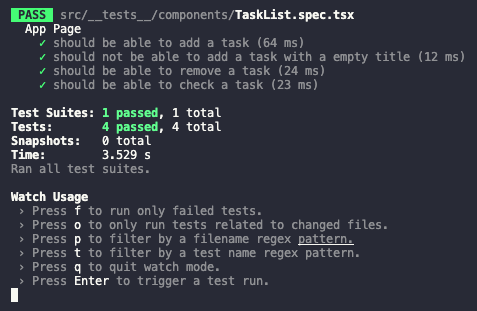

# TODO

<p align="center" >
    
</p>

# About The Project

This is a simple TODO project with React JS.

## The Challange

Create three functions to manipulate the data in a TODO list:

- `handleCreateNewTask()` - Add new task
- `handleToggleTaskCompletion()` - Check task completed
- `handleRemoveTask()` - Delete task

## Run the Project

Run the following codes:

```bash
git clone https://github.com/leomiranda/rocketseat-ignite-reactjs-chapter-01-challenge-01.git
cd rocketseat-ignite-reactjs-chapter-01-challenge-01
yarn
yarn dev
```

## Validade with Test

To validate the functions run the following code:

```bash
yarn test
```

Test result:

<p align="center" >
    
</p>
