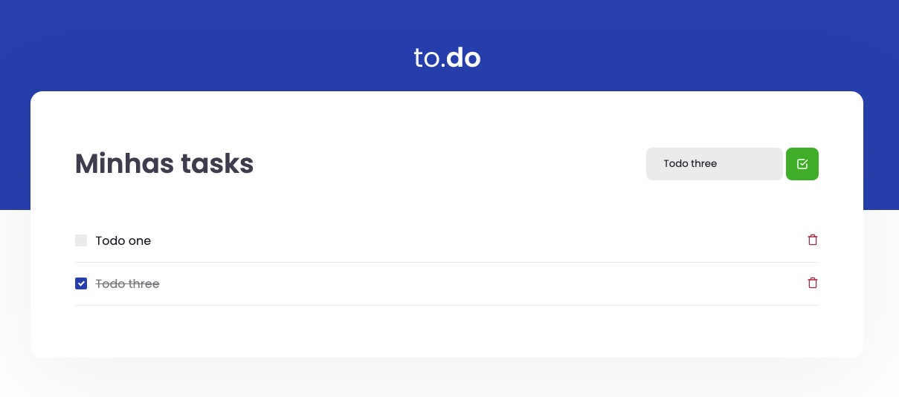

# TODO

    

 

# About The Project

This is a simple React JS project TODO.

## The Challange

Create a three functions

This project helped me to consolidate knowledge on React fundamentals like:

- Components
- State
- Props

I had to develop three functions on this app:

- Add new task
- Check task completed
- Delete task

The tests was made by Rocketseat team, and the grade was gave by Rocketseat's platform!

#theFutureIsOpenSource :fire:
